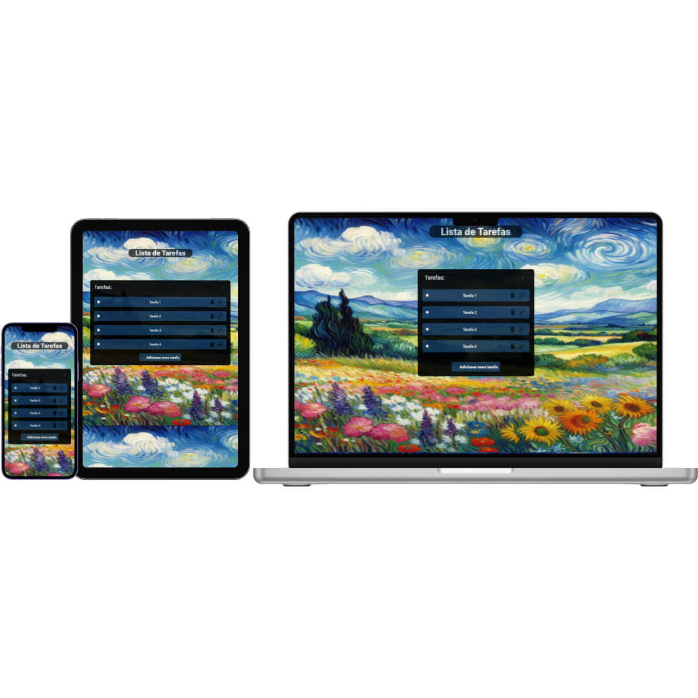

# To-do-list

## Sobre
Você pode adicionar novas tarefas, remover ou editar, a função filtro permite mostrar apenas as tarefas pendentes ou apenas as concluidas e todas as tarefas.
Constuido com HTML, CSS Javascript e Typescript.
Feito em trio como desafio de aprendizagem do programa trilhas do inova maranhão.

## Responsivo
 Funcional em diferentes telas.

## Contribuições
<a href="https://github.com/widson27/To-do-list/graphs/contributors">@enzo-felipe0 @geovanepp</a>

## License

[MIT](https://choosealicense.com/licenses/mit/)